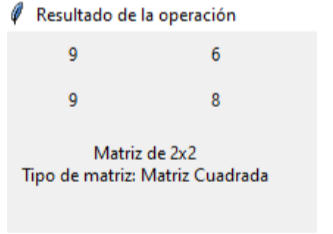

<div align="center">

# 🧮 MatrizApp

### Aplicación de escritorio en Python para realizar operaciones con matrices

**Python · Tkinter · Programación modular**

</div>

---

## 📖 Descripción

**MatrizApp** es una aplicación desarrollada en Python que permite crear matrices y realizar diferentes operaciones matemáticas mediante una interfaz gráfica sencilla.

La aplicación guía al usuario paso a paso: primero se indican las dimensiones de la matriz, luego se ingresan sus elementos, se selecciona la operación y finalmente se muestra el resultado.

---

## ✨ Funcionalidades

- Crear matrices indicando el número de filas y columnas.
- Ingresar los elementos de la matriz desde una interfaz gráfica.
- Identificar las dimensiones de la matriz.
- Realizar **suma de matrices**.
- Realizar **resta de matrices**.
- Realizar **multiplicación por escalar**.
- Realizar **multiplicación de matrices**.
- Solicitar una segunda matriz cuando la operación lo requiere.
- Mostrar la matriz resultante.
- Mostrar el tipo de matriz obtenida.
- Interfaz desarrollada con **Tkinter**.

---

## 🖥️ Vista de la aplicación

### 1. Pantalla de inicio

La aplicación solicita el número de filas y columnas que tendrá la matriz.

<p align="center">
  
</p>

---

### 2. Creación y llenado de la matriz

Después de establecer las dimensiones, se muestran los campos necesarios para ingresar cada elemento.

<p align="center">
  
</p>

---

### 3. Selección de la operación

Una vez creada la matriz, la aplicación permite elegir la operación que se desea realizar.

Las operaciones disponibles son:

- ➕ Suma
- ➖ Resta
- ✖️ Multiplicación por escalar
- 🔢 Multiplicación de matrices

<p align="center">
  
</p>

---

### 4. Ingreso de la segunda matriz

Para las operaciones que necesitan dos matrices, la aplicación solicita los elementos de la segunda matriz.

<p align="center">
  
</p>

---

### 5. Resultado de la operación

Finalmente, MatrizApp muestra los valores de la matriz resultante, sus dimensiones y su clasificación.

<p align="center">
  
</p>

---

## 📁 Estructura del proyecto

```text
MatrizApp/
│
├── Interfaz.py
├── matrix_operations.py
├── README.md
├── .gitignore
│
└── imagenes/
    ├── inicio.png
    ├── creacion-matriz.png
    ├── operaciones.png
    ├── segunda-matriz.png
    └── resultado.png


